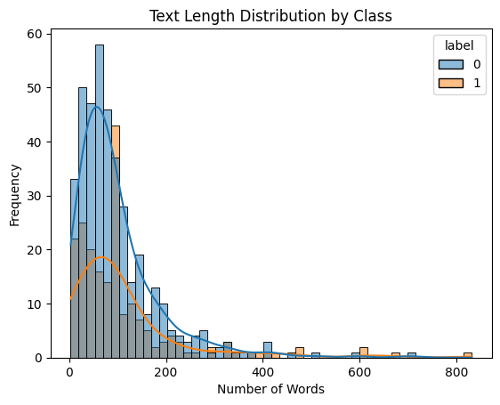

# Narcissism Detection Using Machine Learning & Deep Learning

This project aims to detect narcissistic traits in text using a combination of classical machine learning models and deep learning (BiLSTM). It is inspired by foundational psychological theories, including Freud's "On Narcissism" and contemporary trait-based models.

## Project Overview

Multiple classification models were explored to identify patterns of narcissism in text data. The project compares the performance of:

- Logistic Regression  
- Random Forest Classifier  
- AdaBoost Classifier  
- BiLSTM (Bidirectional Long Short-Term Memory)

The models are trained and evaluated on preprocessed text labeled as narcissistic (1) or not (0), using features such as text length, TF-IDF vectors, and embedded sequences.

## Files

| File | Description |
|------|-------------|
| `mlwp_project.ipynb` | Classical ML models (LogReg, RF, AdaBoost) |
| `mlwp_lstm.ipynb` | Deep learning model with BiLSTM |
| `reddit.csv` | Input datasets |
| `plots/` | Visualization outputs (e.g., histograms, accuracy plots) |

## Psychology Background

- Freud (1914) described narcissism as self-love and the "ego ideal."
- Miller et al. (2017) proposed two types: **grandiose narcissism** (dominant, confident) and **vulnerable narcissism** (sensitive, insecure).

These concepts influenced how features were selected and interpreted.

## Models and Methods

- **Feature Engineering**: TF-IDF, text length
- **Class Imbalance**: Addressed with sampling
- **Evaluation Metrics**: Accuracy, F1 score, confusion matrix
- **Visualization**: Text length distribution, KDE plots

## Example Plot

**Python version**: 3.7+
## Key packages**:

- scikit-learn
- tensorflow / keras
- matplotlib, seaborn
- nltk, pandas, numpy

## References:
- Freud, S. (1914). On Narcissism: An Introduction.
- Miller, J.D. et al. (2017). Controversies in Narcissism.

## License:
MIT License

## Author:
Aizhan Kussainova
Nazarbayev University/ELCE455
GitHub: Kussaiz
